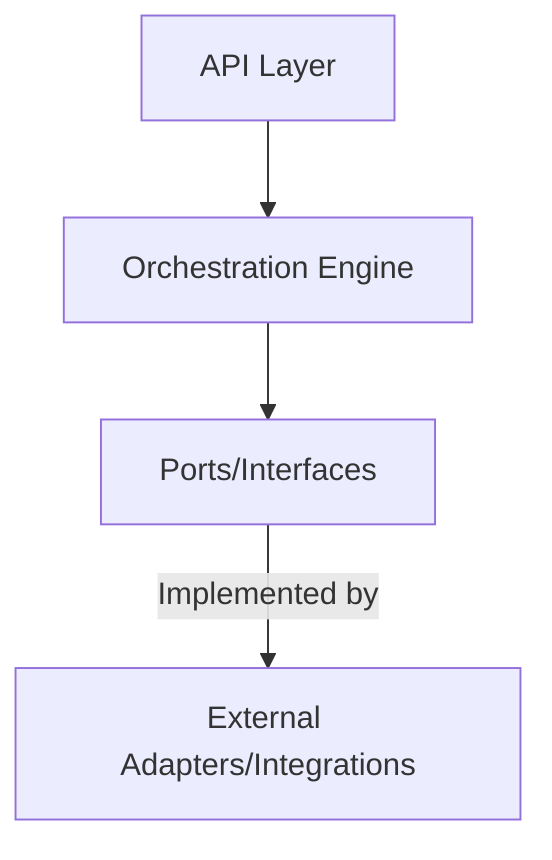

# Architecture

## Overview
- Only orchestration logic, API, and interfaces/ports live in this repo.
- All adapters, integrations, and domain models are externalized.
- Dependency injection and testability are first-class.

## Diagram

## Key Files
- `src/orchestration_svc/api/routes.py`: API endpoints
- `src/orchestration_svc/engine/core.py`: Orchestration logic
- `src/orchestration_svc/domain/ports.py`: Public interfaces/contracts
- `src/orchestration_svc/container.py`: Dependency injection
